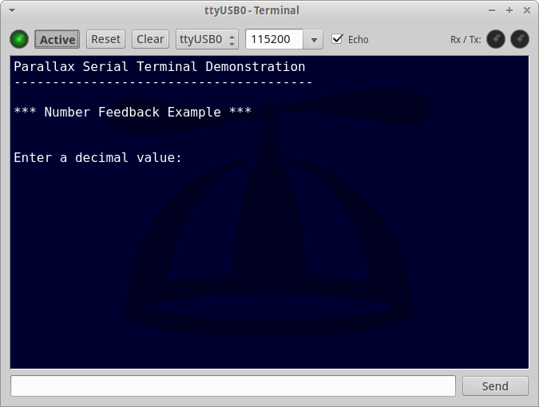
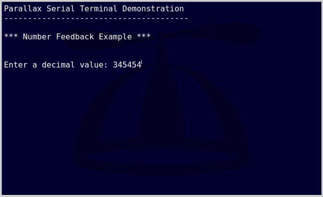

= Terminal

PropellerIDE has a built-in serial terminal you can use to debug your Propeller programs.

There are no restrictions on the number of terminals that can be open at a time, even on the same device, and software can be downloaded to attached devices without disconnecting terminals first.

== Tool Bar

image:terminal-device.png[]
image:terminal-echo.png[]

==== image:terminal-activelight.png[] Active Light & Button

When the light is green and *Active* is pressed, the device is connected
and ready to send and receive data.

==== Reset

Sends a hardware reset to the board.

==== Clear

Clears all text from the console and sets the cursor back to the top left.

==== Port Name

The name of the port this terminal is currently attached to.

==== Baud Rate

The rate of transmission to the board. Type in the baud rate you want, or click
the arrow to select from a lit of common baud rates.

==== Echo Enabled

When echo is enabled, everything you type will be copied to the console, in addition
to being sent to the device. Some software expects echo to be enabled, while others
send the data back to the console themselves, which will result in duplicated text.

Try toggling this feature if your application isn't behaving how you want it to.

==== Rx / Tx Lights

These lights indicate when data is received or sent, respectively.

== Input

There are two ways to input text

- Through the console itself
- Through the _input line_ at the bottom of the window

=== Console

Using the console is recommended when the target device supports a more advanced command-line interface, as it will allow you to take advantage of things like readline capabilities, cursor positioning, etc.

Pressing the `Enter` or `Return` key sends a single newline (ASCII `10`) to the device.

=== Input Line

For simpler interfaces, the input line is a better choice.

Pressing the `Enter` or `Return` sends the text without newline. Pressing the _Send_ button sends the text plus a single newline.

== _Parallax Serial Terminal_ Compatibility

The following ASCII characters implement basic terminal compatible with the original Propeller Tool's serial terminal.

|===
| 16 | Clear Screen
| 11 | Clear to End of line
| 1 | Home cursor
| 2 | Position Cursor in x,y
| 14 | Position cursor in X
| 15 | Position cursor in Y
| 13 | New Line

| 10 | Line Feed
| 3 | Move cursor Left
| 4 | Move cursor Right
| 5 | Move cursor Up
| 6 | Move cursor Down
| 9 | Tab
| 8 | Backspace
|===

PropellerIDE includes a corresponding `com.serial.terminal` object that implements these control characters.