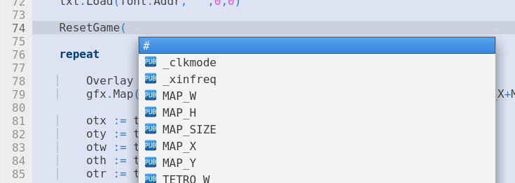
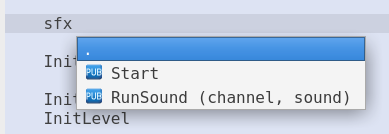

= Code Completion
:experimental:

PropellerIDE supports the following code completions.

- Public functions
- Constants

You can complete code from the current file or another file in the path in the main file's directory or a directory in the library path.

== Completing From The Current File

As of v0.36.7, PropellerIDE supports completing within the current file.

- Typing `#` brings up a list of constants.
- Typing `.` brings up a list of functions.

Press kbd:[Esc] to quit without completing. Press kbd:[Enter] or kbd:[Return] to accept the completion.

.Completing a constant from the current file.

== Completing From Another File

You can also complete code from another file.

- Typing the alias of an objectfootnote:[e.g. where we declare an object `kbd : "Keyboard"`, the alias is `kbd`.], then `#` opens a list of constants.
- Typing the alias of an object, then `.` opens a list of functions.

As with before, kbd:[Esc] quits, kbd:[Enter] or kbd:[Return] accepts.

.Completing a function from another file.
