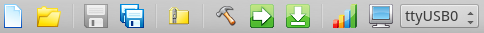
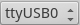

# Tool Bar

== File

==== image:file-new.png[] New

Creates a new file.

==== image:file-open.png[] Open

Opens an existing file.

==== image:file-save.png[] Save

Saves the current file to disk.

==== image:file-save-as.png[] Save As

Saves a copy of the current file under a new name. The original file is not saved.

== Project

==== image:file-zip.png[] Archive Project

Builds an link:project-archive.adoc[archive] of the current project.

==== image:project-build.png[] Build Project

Compiles the current project without downloading it.

==== image:project-run.png[] Run Project

Compiles and downloads it to the currently selected board.

==== image:project-burn.png[] Write Project

Compiles the project, downloads it to the board, and writes it to the board's first EEPROM.

====  Device Selector

Selects the target download device from any available devices connected to the system.

== Debugging

==== image:project-info3.png[] Memory Map

Opens the link:../tools/memory-map.adoc[Memory Map] widget.

==== image:project-terminal.png[] Terminal

Opens the link:../tools/terminal.adoc[Terminal] widget.