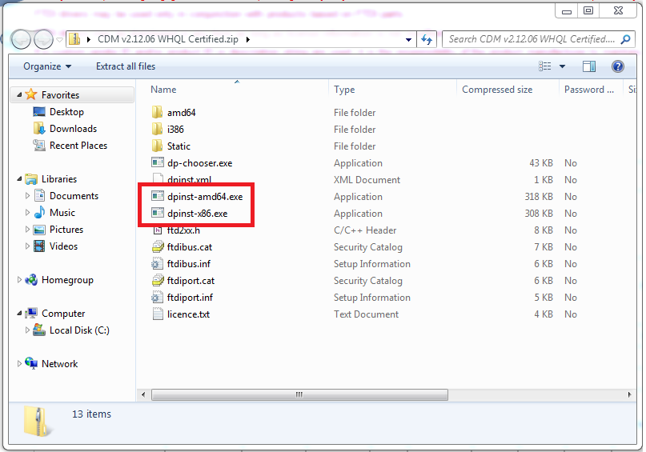
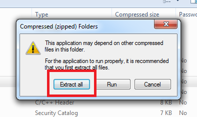
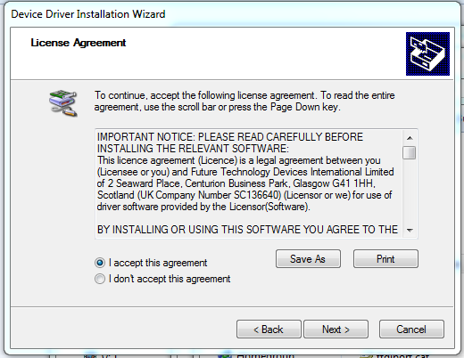

= Installing FTDI Drivers

In this tutorial we will walk you through installing the FTDI
USB-to-Serial driver. This is required to use the Propeller on all wired
platforms.

== Windows

Head over to the http://www.ftdichip.com/Drivers/VCP.htm[FTDI website],
and scroll down to the chart under "VCP Drivers" and select the download
according to your operating system.

image:driver1.png[]

Select the most recent version and start the download (either will
download the same zipped file).

image:win1.png[]

After download finishes, open the zipped file.This file will contain
both executables for 32- and 64-bit processors. Select the one your
computer runs (dpinst-amd64 for 64-bit and dpinst-x86 for 32-bit).

image:win8.png[]

Click "Extract All" when a window pops up to extract the files.

Click "Extract" into a destination. Another window will pop up
containing files.

image:win4.png[]

In this popped up window, double click on the same executable from before. Remember to click ""Yes" to allow the program to make changes to your computer.

image:win5.png[]

image:win7.png[]

Follow the instructions until installation is completed.

== Linux

On Debian, open a terminal and use the "apt" package manager to install to your system.

    sudo apt-get install libftdi1

On Fedora, use the "yum" package manager.

    sudo yum install libftdi