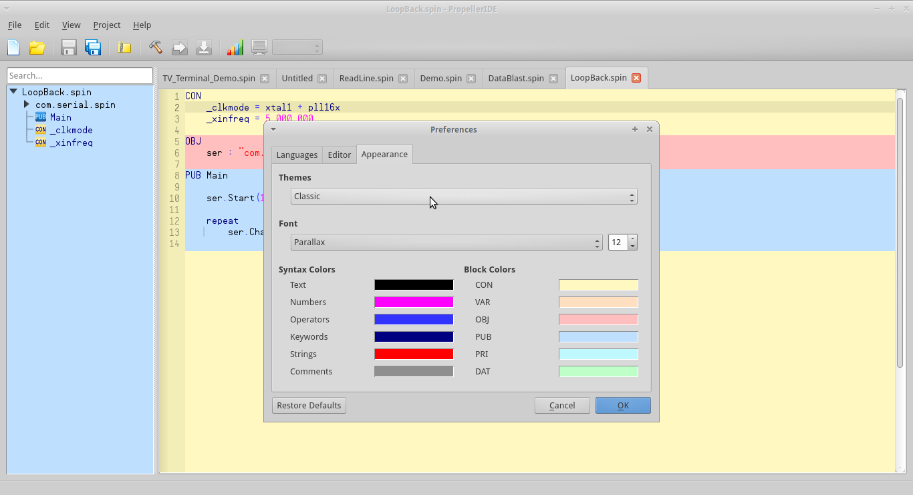
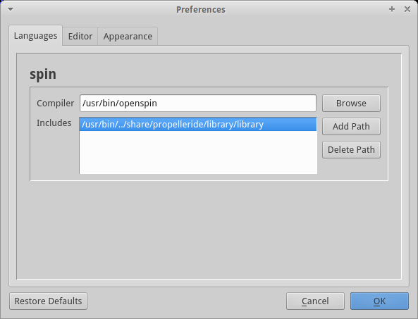
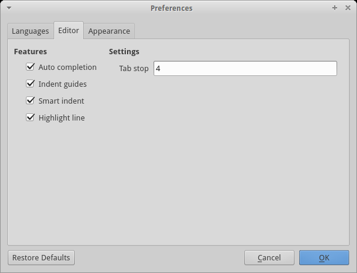

= Preferences
:icons:

== Appearance

PropellerIDE can be themed to suit your preference in the _Appearance_ tab. Click to select from a drop-down of themes or monospace fonts, or double-click on one of the color swatches to open a color picker. 

image:appearance.png[]

Changes to the appearance will propogate instantly throughout the IDE.

=== Classic Theme

PropellerIDE provides the _Classic_ theme for compatibility with the original Propeller Tool. It supports the legacy Parallax font with the proprietary Propeller character mapping.

[WARNING]
.The Parallax font is deprecated
====
The Parallax font's proprietary character mapping is not portable and is only provided for legacy support. Consider the use of a standalone diagramming tool or plain ASCII for creating in-source diagrams.
====

== Languages

PropellerIDE supports multiple library paths to be searched from top to bottom.

[NOTE]
====
This is still an in-progress feature.
====

== Editor

Auto completion:: Toggles code completion
